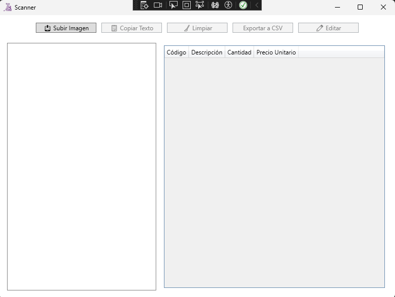

# 💼 Extract Text of Images

Project to extract text from images and process it to filter product data, using the Google Cloud Vision API and the Gemini AI API within the Visual Studio environment with C# .NET.

---

## 📌 Description
This is a desktop application, developed in Visual Studio with C# .NET, to extract text from images and intelligently process it to filter for product data.
The main goals of this project were to:
- Utilize the Google Cloud Vision API for accurate and efficient text extraction (OCR).
- Process the extracted text using the Gemini AI API to intelligently filter and obtain product-specific data.
- Design a user-friendly interface to easily upload images and view the filtered results.
- Demonstrate the use of modern APIs and robust C# development within a desktop application environment.

---

## 🛠 Technologies used
- **.net** (framework)
- **C#** (lnaguaje)
- **Visual Studio** (development environment)  

---

## ✨ Features
- Google Cloud Vision API integration for accurate and precise text extraction.
- Gemini AI API utilization for intelligent data analysis and product data filtering.
- Simple and intuitive user interface for a smooth user experience.
- Developed with C# .NET, ensuring a robust, secure, and performant application.
- Clear and organized project structure for easy maintenance and future scalability.

---

## 📸 Preview


---

## 🚀 How to run this project
```bash
# Clone the repository
git clone https://github.com/DanielCoronelPV/Extractor-de-texto-en-imagen.git

# Navigate into the project folder
cd ExtractTextGoogleAi

# Run the development server
Run aplication
```

---

## 📁 Structure
```bash
/project-root
│
├── Properties
│   ├── Resources.Designer.cs
│   ├── Resources.resx
│   ├── Settings.Designer.cs
│   └── Settings.settings
├── Assets
│   ├── favicon.ico
│   ├── gemini-apikey.txt
│   └── google-credentials.json
├── Models
│   └── ProductoExtraido.cs
├── Services
│   ├── GeminiAiService.cs
│   ├── GoogleVisionService.cs
│   └── OcrResult.cs
├── App.xaml
├── AssemblyInfo.cs
└── MainWindow.xaml
```
